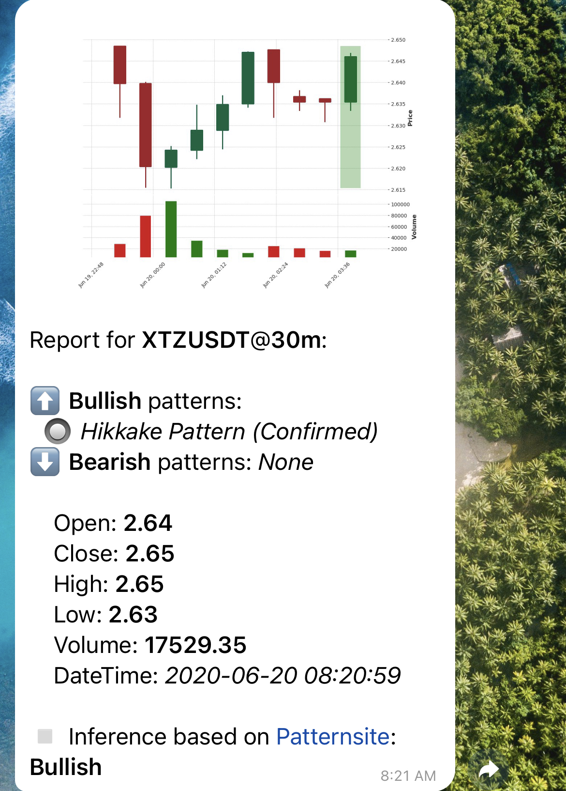
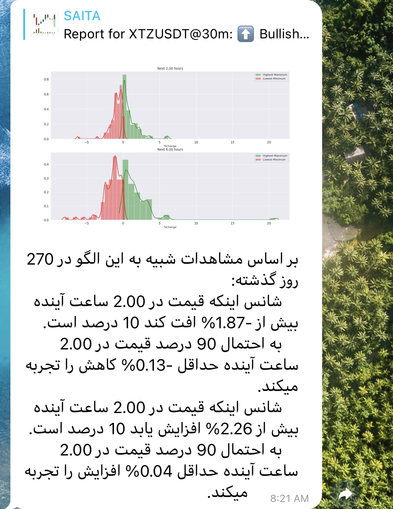

# CryptoSAITA

A Telegram bot which is an AI-based Trading Assistant (AITA).

## Install (ubuntu):
- `conda create -n crypto python=3.6.4`
- `conda activate crypto`
- `conda install pandas`
- `conda install matplotlib`
- `pip install mplfinance`
- `conda install seaborn`
- `conda install scikit-learn`
- `pip install peewee`
- `pip install ccxt`
- `pip install python-binance`
- `pip install python-telegram-bot --upgrade`
- `conda install -c quantopian ta-lib`
- `conda install requests`
- `conda install psutil`
- `conda install plotly`
- `conda install -c plotly plotly-orca`

## How to use?
After installing the required packages, place your *binance API Key and secret Key* on `binance.txt` file, and your telegram bot token on `telegram.txt`, then run the main file:
`python3 run main.py`

## Sample Reports
*Pattern-based Report*

*Data-based Report (This is *Persian* :)) )*

